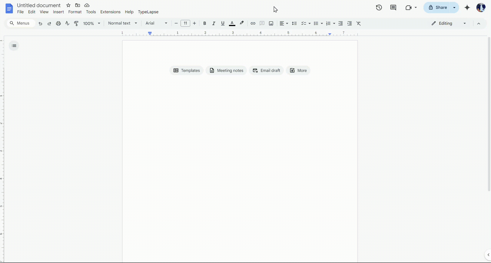

# **TypeLapse**  
Simulates slow, natural typing to automatically generate content in Google Docs over time. Perfect for creating timelines, or live writing effects.

> [!IMPORTANT]
> To use this script, you must have Tampermonkey installed.

#### [Greasy Fork](https://greasyfork.org/en/scripts/521151-typelapse)

---

## **Setup**  

1. **Install Tampermonkey**  
   - If you don’t have it already, install the [Tampermonkey](https://www.tampermonkey.net/) extension.

2. **Add the Script**  
   - Open Tampermonkey.  
   - Click “Create a new script”.  
   - Replace the content with the **TypeLapse** script.

3. **Save and Activate**  
   - Click **Save**.  
   - Ensure the script is enabled in Tampermonkey.

---

## **How to Use**  

1. Open a **Google Docs** document.  
2. Click on the heading that says "TypeLapse"
3. Follow the instructions by pasting in your text and selecting your desired delay time in milliseconds.

